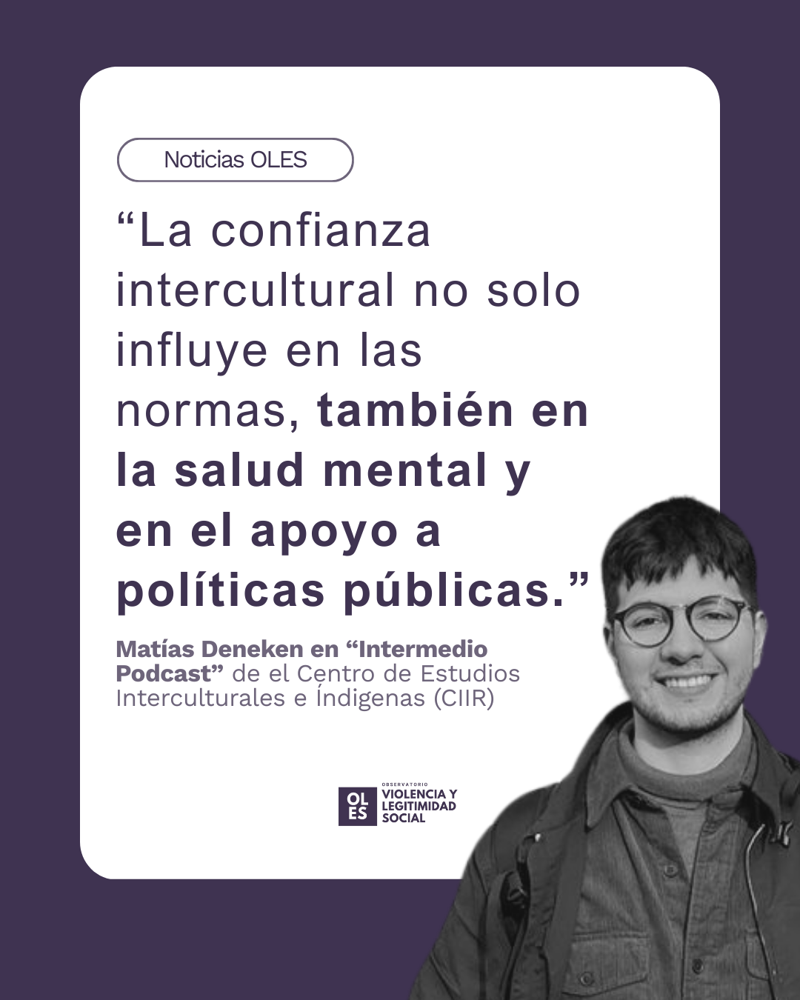

::: {.featured-image}

:::

En el marco del lanzamiento del libro Reconfiguraciones interculturales, Matías Deneken, asistente de investigación de OLES, fue invitado a Intermedio Podcast del Centro de Estudios Interculturales e Indígenas (CIIR), donde conversó con Matías Hermosilla sobre los principales aprendizajes del estudio longitudinal que da origen al libro.

La investigación siguió durante ocho años a las mismas personas indígenas y no indígenas en Chile, permitiendo observar cómo la confianza, las actitudes y la percepción de conflicto se ven atravesadas por la historia reciente del país. En la conversación, Deneken enfatiza que la confianza intercultural no es solo una cuestión de normas o discursos, sino que tiene efectos concretos en la salud mental y en el apoyo a políticas públicas.

“Una de las principales apuestas de los estudios longitudinales es que la historia ocurra”, señala Deneken, destacando cómo procesos como el estallido social y los debates constitucionales se inscriben directamente en las trayectorias de las personas y en sus formas de relacionarse. La conversación abre así un espacio para pensar las relaciones interculturales en Chile desde una mirada de largo plazo, anclada en evidencia empírica.

Revisa el capítulo completo de Intermedio Podcast aquí:
 🔗 https://t.ly/51oLF

[← Volver a Noticias](../index.html)
