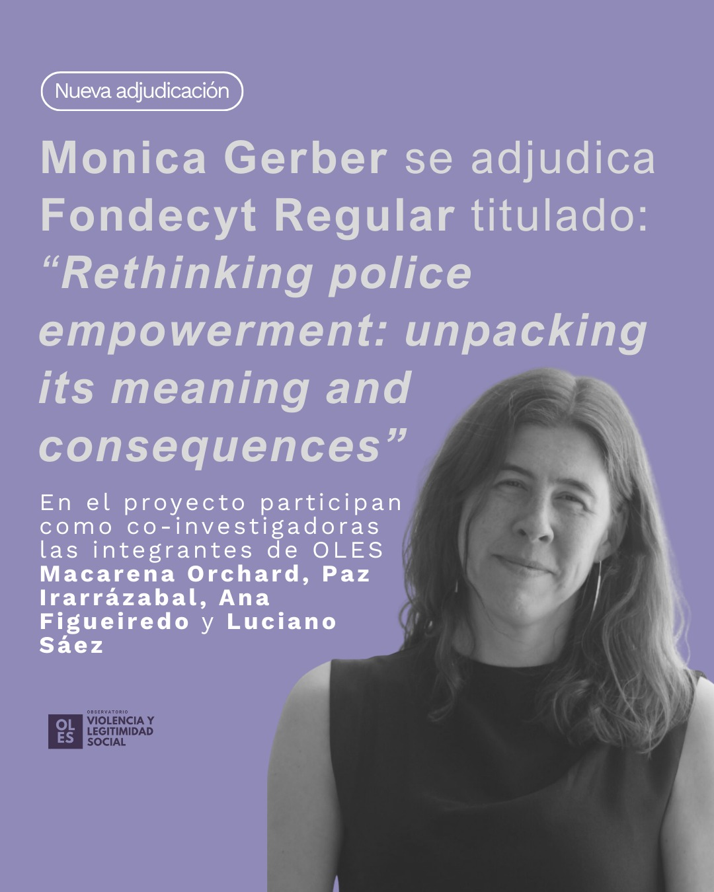

::: {.featured-image}

:::

Monica Gerber, Directora del Observatorio de Violencia y Legitimidad Social (OLES), se adjudicó un Fondecyt Regular con el proyecto "Rethinking police empowerment: unpacking its meaning and consequences.".

La investigación se desarrolla desde una perspectiva interdisciplinaria y busca aportar al análisis académico sobre policía, seguridad y legitimidad social en el contexto chileno.

El estudio cuenta con un equipo de investigadoras vinculadas a OLES, integrado por Macarena Orchard (Universidad Diego Portales), Paz Irarrázabal González (Universidad de Chile), Ana Figueiredo (Universidad de O’Higgins) y Luciano Sáez (Universidad Diego Portales).

Desde OLES celebramos este importante logro y felicitamos a Monica Gerber y al equipo OLES por este nuevo paso en su trabajo investigativo

[← Volver a Noticias](../index.html)
