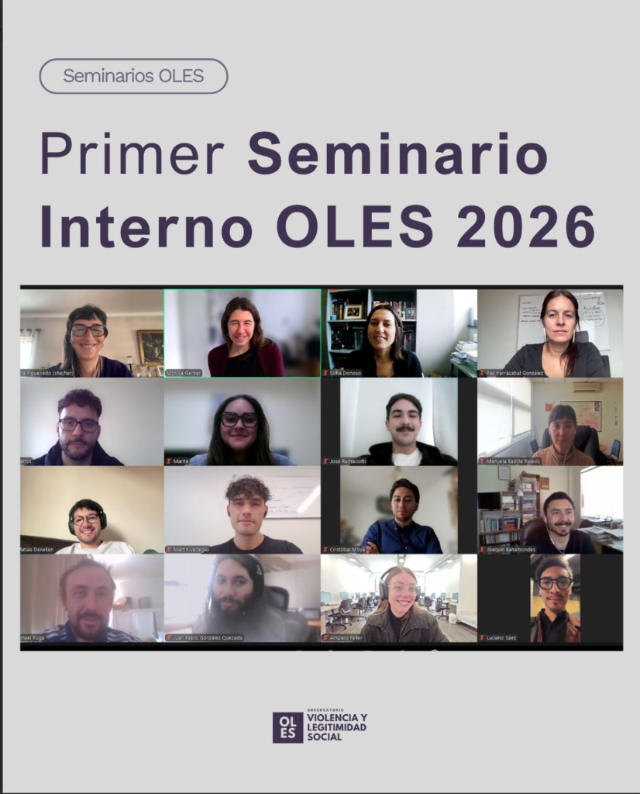

::: {.featured-image}

:::

El pasado lunes 27 de abril, llevamos a cabo el Primer Seminario Interno del Equipo OLES 2026. Este seminario estuvo centrado en revisar y organizar aspectos sobre esta nueva etapa del Observatorio, así como también, de dar la bienvenida a quienes se integran al equipo.

Este año hay mucho entusiasmo por comenzar a abordar y conversar de nuevas temáticas, así como también, en profundizar aquellas que ya venimos trabajando durante los años de este proyecto colectivo.

Les invitamos a seguir nuestras redes y poner atención a las nuevas actividades, convocatorias y noticias del OLES.

[← Volver a Noticias](../index.html)
