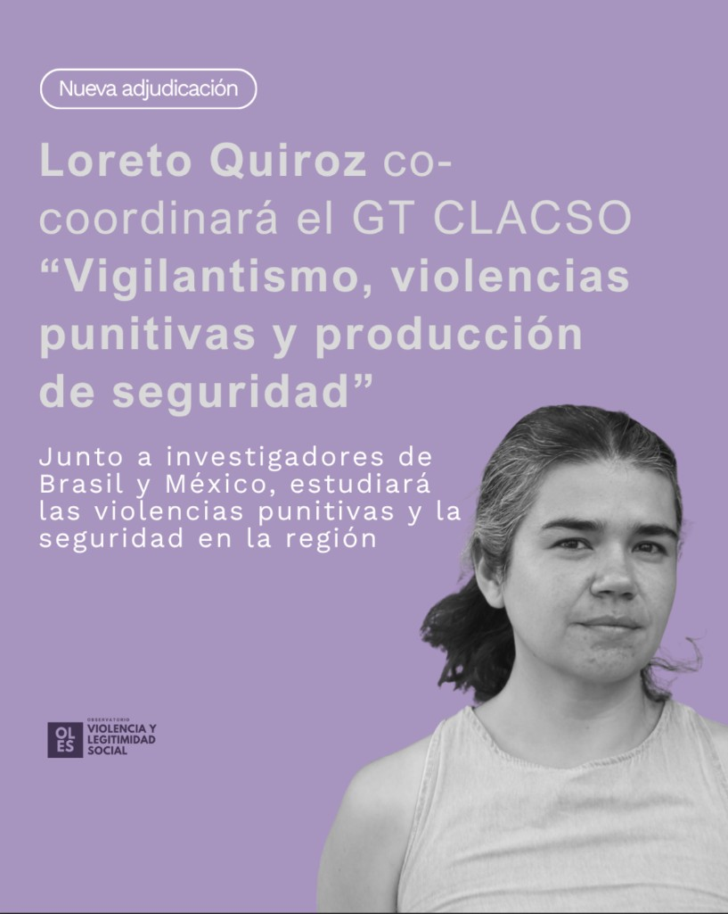

::: {.featured-image}

:::

La investigadora del Observatorio de Violencia y Legitimidad Social (OLES), [Loreto Quiroz](../../equipo/loreto-quiroz.html), fue seleccionada como co-coordinadora de un Grupo de Trabajo del Consejo Latinoamericano de Ciencias Sociales (CLACSO) para el periodo 2026–2028. El grupo, titulado "Vigilantismo, violencias punitivas y producción de seguridad", reúne a investigadores de distintos países de la región, incluyendo México y Brasil, consolidando una red internacional de colaboración académica.

La adjudicación se enmarca en la convocatoria trienal de CLACSO, instancia en la que se seleccionan propuestas que articulan investigación en red sobre problemáticas relevantes para América Latina. Los Grupos de Trabajo constituyen uno de los espacios centrales de producción de conocimiento del organismo, promoviendo el desarrollo de agendas de investigación, publicaciones conjuntas, formación de nuevas generaciones y vinculación con el debate público.

## Un aporte conceptual al estudio del vigilantismo

El grupo co-coordinado por Quiroz da continuidad a una línea de investigación que ha buscado comprender las transformaciones contemporáneas de la violencia y las prácticas de seguridad en la región. Uno de sus principales aportes ha sido conceptualizar el vigilantismo no como una simple ausencia del Estado, sino como un fenómeno relacional, inserto en las dinámicas de gobernanza securitaria latinoamericanas. A partir de este enfoque, el equipo ha propuesto categorías como vigilantismo duro, blando y difuso, contribuyendo a complejizar el análisis de las violencias punitivas en el continente.

Este trabajo también ha puesto en evidencia que dichas violencias no son fenómenos marginales o residuales, sino que forman parte constitutiva de las formas actuales de producción de seguridad en América Latina. En este sentido, el reconocimiento de CLACSO no sólo valida la relevancia teórica y empírica de esta línea de investigación, sino que también fortalece un campo de estudios aún en proceso de consolidación.

## Proyecciones para el periodo 2026–2028

Para el nuevo periodo, el grupo proyecta profundizar en temas como la relación entre seguridad y cuidado, el impacto de las tecnologías de vigilancia, las narrativas sociales sobre la violencia y las formas contemporáneas de coproducción del control social. Asimismo, se plantea como desafío ampliar la articulación con actores no académicos e incidir en políticas públicas en un contexto regional marcado por la expansión de discursos punitivos y la centralidad de la inseguridad en la agenda política.

La participación de Loreto Quiroz en este espacio refuerza el compromiso de OLES con la producción de conocimiento crítico sobre violencia, seguridad y democracia, así como con el fortalecimiento de redes de investigación a nivel latinoamericano.

[← Volver a Noticias](../index.html)
