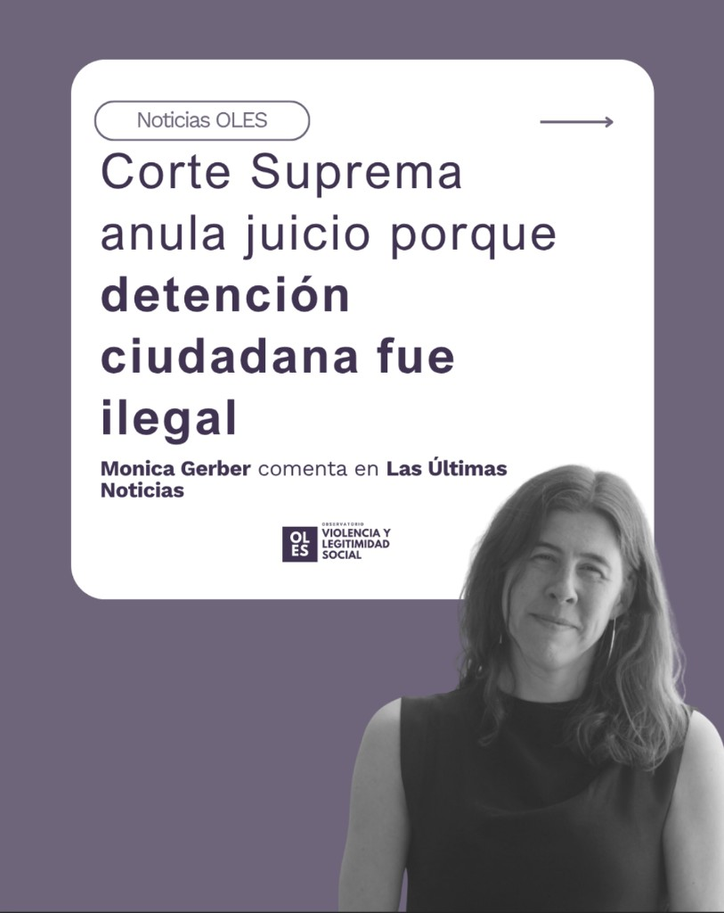
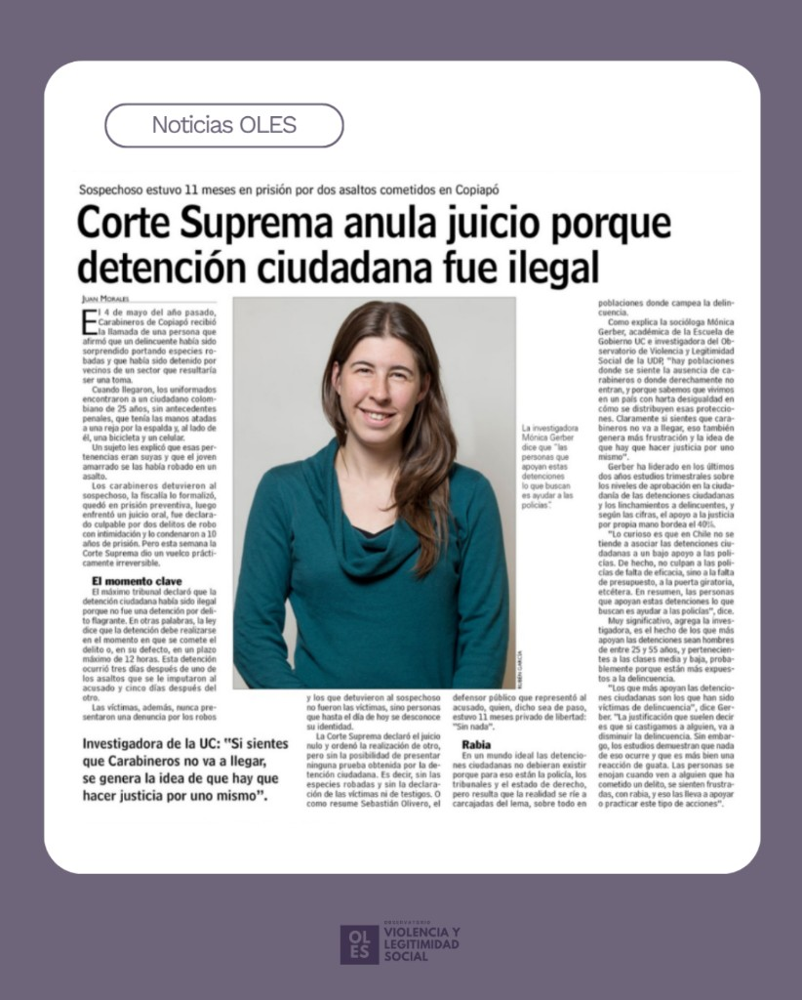

::: {.featured-image}

:::

La directora del Observatorio de Violencia y Legitimidad Social (OLES), [Monica Gerber](../../equipo/monica-gerber.html), fue consultada en un reportaje de prensa a propósito del reciente fallo de la Corte Suprema que anuló un juicio por considerar ilegal la detención ciudadana que dio origen al caso.

## El caso y el fallo de la Corte Suprema

La decisión del máximo tribunal se refiere a un caso ocurrido en Copiapó, donde un hombre fue retenido por civiles varios días después de la comisión de dos delitos. El imputado permaneció 11 meses en prisión preventiva y fue posteriormente condenado, sin embargo, la Corte Suprema determinó que no existía flagrancia en el momento de su detención, lo que invalida las pruebas obtenidas y deja sin efecto el juicio.

## Las detenciones ciudadanas en Chile

En este contexto, Gerber abordó las percepciones ciudadanas en torno a las detenciones por mano propia, destacando que estas no se explican únicamente por una desconfianza directa hacia las policías, sino por una combinación de factores asociados al funcionamiento del sistema de seguridad.

> "Lo curioso es que en Chile no se tiende a asociar las detenciones ciudadanas a apoyo a las policías. De hecho, no apoyan a las policías por falta de eficacia, sino a la falta de presupuesto, a la puerta giratoria, etcétera. En resumen, las personas que apoyan estas detenciones buscan ayudar a las policías", señaló.

Desde el trabajo de investigación desarrollado por OLES, este tipo de prácticas también se vincula a contextos de desigualdad y a la percepción de ausencia o insuficiencia del Estado en determinados territorios, lo que puede traducirse en respuestas ciudadanas marcadas por la frustración frente al delito.

El caso reabre así el debate sobre los límites de la detención ciudadana, sus implicancias legales y las tensiones entre seguridad, legitimidad y Estado de derecho.

::: {.featured-image}

:::

[← Volver a Noticias](../index.html)
