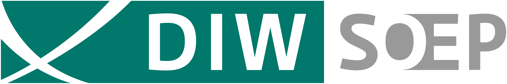

```{=html}
<style>
.somos-container {
  max-width: 1000px;
  margin: 0 auto;
  padding: 2rem 1rem;
}

.somos-intro {
  font-size: 1.15rem;
  line-height: 1.9;
  color: #333;
  margin-bottom: 2rem;
}

.highlight-box {
  background: linear-gradient(135deg, #4E4976, #453958);
  color: white;
  padding: 2rem;
  border-radius: 12px;
  margin: 2rem 0;
}

.highlight-box p {
  margin: 0;
  font-size: 1.1rem;
  line-height: 1.7;
}

.somos-section {
  margin: 3rem 0;
}

.somos-section h2,
.somos-container > h2 {
  color: #4E4976;
  font-size: 1.8rem;
  border-bottom: 3px solid #4E4976;
  padding-bottom: 0.5rem;
  margin-bottom: 1.5rem;
}

.estudios-grid {
  display: grid;
  grid-template-columns: repeat(auto-fit, minmax(300px, 1fr));
  gap: 1.5rem;
  margin-top: 1.5rem;
}

.estudio-card {
  background: white;
  border-radius: 12px;
  padding: 1.5rem;
  box-shadow: 0 4px 15px rgba(0,0,0,0.08);
  border-left: 4px solid #4E4976;
  transition: transform 0.3s ease, box-shadow 0.3s ease;
}

.estudio-card:hover {
  transform: translateY(-3px);
  box-shadow: 0 8px 25px rgba(0,0,0,0.12);
}

.estudio-card h4 {
  color: #4E4976;
  margin: 0 0 0.5rem 0;
  font-size: 1rem;
}

.estudio-card p {
  color: #666;
  margin: 0;
  font-size: 0.9rem;
  font-style: italic;
}

.fondos-grid {
  display: grid;
  grid-template-columns: repeat(4, 1fr);
  gap: 1.25rem;
  margin-top: 2rem;
  padding: 1.5rem;
  background: #f8f7fc;
  border-radius: 16px;
  justify-items: center;
  align-items: center;
}

@media (max-width: 768px) {
  .fondos-grid {
    grid-template-columns: repeat(2, 1fr);
  }
}

.fondo-card {
  background: transparent;
  border-radius: 0;
  padding: 0.5rem;
  text-align: center;
  box-shadow: none;
  transition: transform 0.2s ease;
}

.fondo-card:hover {
  transform: translateY(-2px);
}

.fondo-card img {
  width: auto;
  max-width: 140px;
  height: 64px;
  object-fit: contain;
  margin: 0;
  filter: drop-shadow(0 4px 8px rgba(0,0,0,0.08));
}

.fondo-card h4 {
  color: #4E4976;
  margin: 0;
  font-size: 1rem;
  font-weight: 700;
}

.fondo-card p {
  color: #666;
  margin: 0;
  font-size: 0.85rem;
  line-height: 1.4;
}

.volver-link {
  display: inline-block;
  margin-top: 2rem;
  color: #4E4976;
  text-decoration: none;
  font-weight: 500;
}

.volver-link:hover {
  text-decoration: underline;
}
</style>

<div class="somos-container">

<h2>¿Qué es el Observatorio de Violencia y Legitimidad Social?</h2>

<div class="somos-intro">
El Observatorio de Violencia y Legitimidad Social (OLES) es una plataforma de investigación multidisciplinaria dedicada al estudio de las distintas formas de violencia, sus modos de justificación y cuestionamiento, y los procesos mediante los cuales se construye y disputa la legitimidad social. El Observatorio busca generar evidencia científica y transferir ese conocimiento a la sociedad, contribuyendo al debate público y a la toma de decisiones orientada a enfrentar estas problemáticas. Para ello se sostiene en procesos de investigación colaborativos y enmarcados en principios de ciencia abierta, con foco en el cuidado de quienes investigan, un compromiso ético con las personas y comunidades a quienes estudia, y un compromiso activo con la formación de nuevas generaciones de investigadoras e investigadores.
</div>

<h2>Equipo</h2>

<p>OLES está compuesto por un equipo multidisciplinario de investigadoras e investigadores de diferentes universidades.</p>
<p><a href="equipo/index.html" class="btn-primary" style="display: inline-block; padding: 0.75rem 1.5rem; background: #4E4976; color: white; text-decoration: none; border-radius: 50px; font-weight: 600;">Ver equipo completo →</a></p>

<div class="somos-section">
<h2>Financiamiento</h2>
<p>OLES ha recibido financiamiento de la Agencia Nacional de Investigación y Desarrollo (ANID), a través de proyectos Exploración y Fondecyt. También ha contado con apoyo de fondos internos de la Universidad Diego Portales y de la Pontificia Universidad Católica de Chile, así como un fondo de la European Association of Social Psychology (EASP).</p>
</div>

<div class="somos-section">
<h2>Instituciones</h2>
<p>OLES se encuentra asociado a las siguientes instituciones:</p>

<div class="fondos-grid">
  <div class="fondo-card">
    
  </div>
  <div class="fondo-card">
    
  </div>
  <div class="fondo-card">
    
  </div>
  <div class="fondo-card">
    
  </div>
  <div class="fondo-card">
    
  </div>
  <div class="fondo-card">
    
  </div>
  <div class="fondo-card">
    
  </div>
</div>
</div>

<a href="index.html" class="volver-link">← Volver al Inicio</a>
```
