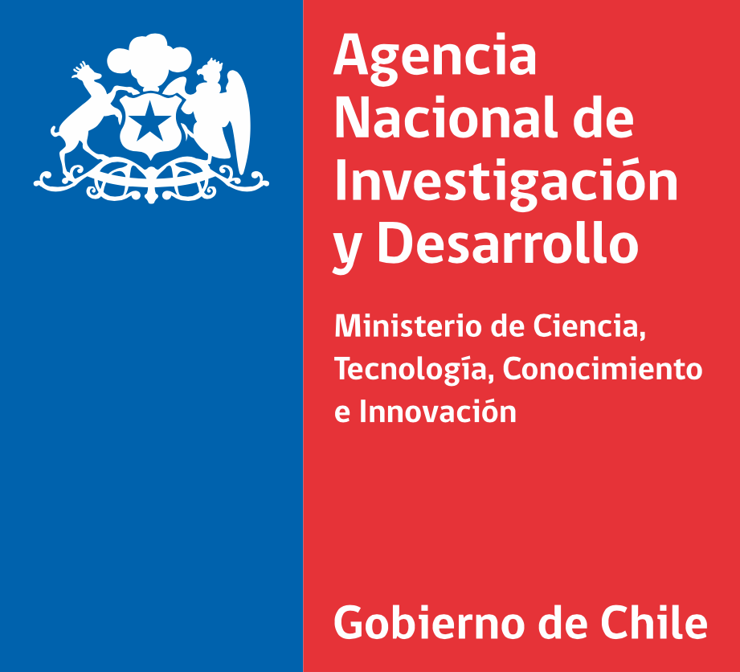

```{=html}
<style>
.somos-container {
  max-width: 1000px;
  margin: 0 auto;
  padding: 2rem 1rem;
}

.somos-intro {
  font-size: 1.15rem;
  line-height: 1.9;
  color: #333;
  margin-bottom: 2rem;
}

.highlight-box {
  background: linear-gradient(135deg, #4E4976, #453958);
  color: white;
  padding: 2rem;
  border-radius: 12px;
  margin: 2rem 0;
}

.highlight-box p {
  margin: 0;
  font-size: 1.1rem;
  line-height: 1.7;
}

.somos-section {
  margin: 3rem 0;
}

.somos-section h2,
.somos-container > h2 {
  color: #4E4976;
  font-size: 1.8rem;
  border-bottom: 3px solid #4E4976;
  padding-bottom: 0.5rem;
  margin-bottom: 1.5rem;
}

.estudios-grid {
  display: grid;
  grid-template-columns: repeat(auto-fit, minmax(300px, 1fr));
  gap: 1.5rem;
  margin-top: 1.5rem;
}

.estudio-card {
  background: white;
  border-radius: 12px;
  padding: 1.5rem;
  box-shadow: 0 4px 15px rgba(0,0,0,0.08);
  border-left: 4px solid #4E4976;
  transition: transform 0.3s ease, box-shadow 0.3s ease;
}

.estudio-card:hover {
  transform: translateY(-3px);
  box-shadow: 0 8px 25px rgba(0,0,0,0.12);
}

.estudio-card h4 {
  color: #4E4976;
  margin: 0 0 0.5rem 0;
  font-size: 1rem;
}

.estudio-card p {
  color: #666;
  margin: 0;
  font-size: 0.9rem;
  font-style: italic;
}

.fondos-grid {
  display: grid;
  grid-template-columns: repeat(4, 1fr);
  gap: 2rem;
  margin-top: 2rem;
}

@media (max-width: 768px) {
  .fondos-grid {
    grid-template-columns: repeat(2, 1fr);
  }
}

.fondo-card {
  background: white;
  border-radius: 12px;
  padding: 1.5rem;
  text-align: center;
  box-shadow: 0 4px 15px rgba(0,0,0,0.08);
  transition: transform 0.3s ease;
}

.fondo-card:hover {
  transform: translateY(-5px);
}

.fondo-card img {
  width: 100%;
  max-width: 120px;
  height: 80px;
  object-fit: contain;
  margin-bottom: 1rem;
}

.fondo-card h4 {
  color: #4E4976;
  margin: 0 0 0.3rem 0;
  font-size: 1.1rem;
}

.fondo-card p {
  color: #666;
  margin: 0;
  font-size: 0.85rem;
  line-height: 1.4;
}

.volver-link {
  display: inline-block;
  margin-top: 2rem;
  color: #4E4976;
  text-decoration: none;
  font-weight: 500;
}

.volver-link:hover {
  text-decoration: underline;
}
</style>

<div class="somos-container">

<h2>¿Qué es OLES?</h2>

<div class="somos-intro">
Desde una mirada <strong>multidisciplinar</strong>, OLES agrupa a investigadores/as de diferentes disciplinas en un esfuerzo por comprender los mecanismos de construcción de <strong>legitimidad social</strong> y problematizar el rol de la <strong>violencia y la justicia</strong> en diferentes contextos, aportando a la construcción teórica de marcos interpretativos sobre su desenvolvimiento en el escenario actual.
<br><br>
Para ello promueve el <strong>diálogo y colaboración</strong> con actores sociales mediante la difusión y trabajo colaborativo que permita la socialización en espacios de relevancia.
</div>

<div class="highlight-box">
<p><strong>Objetivo Principal:</strong> Contribuir a la comprensión de los mecanismos de legitimidad social y justificación de la violencia mediante el desarrollo de investigaciones bajo criterios de <strong>Ciencia Abierta</strong> y en diálogo con actores sociales.</p>
</div>

<p style="font-size: 1.1rem; line-height: 1.8;">
Actualmente cuenta con el apoyo del <strong>Centro de Estudios de Conflicto y Cohesión Social (COES)</strong>, la <strong>Universidad Diego Portales (UDP)</strong>, la <strong>Universidad de Chile (UChile)</strong>, la <strong>Universidad de O'Higgins (UOH)</strong> y la <strong>Universidad Católica del Norte (UCN)</strong>.
</p>

<h2>Equipo</h2>

<p>El equipo de OLES está conformado por investigadores principales, investigadores asociados y asistentes de investigación provenientes desde diferentes universidades y disciplinas.</p>
<p><a href="equipo/index.html" class="btn-primary" style="display: inline-block; padding: 0.75rem 1.5rem; background: #4E4976; color: white; text-decoration: none; border-radius: 50px; font-weight: 600;">Ver equipo completo →</a></p>

<div class="somos-section">
<h2>🤝 Fondos y Apoyo Institucional</h2>
<p>OLES cuenta con el reconocimiento y apoyo financiero de:</p>

<div class="fondos-grid">
  <div class="fondo-card">
    
    <h4>ANID</h4>
    <p>Fondecyt Regular</p>
  </div>
  <div class="fondo-card">
    
    <h4>UDP</h4>
    <p>Universidad Diego Portales</p>
  </div>
  <div class="fondo-card">
    
    <h4>UC</h4>
    <p>Pontificia Universidad Católica de Chile</p>
  </div>
  <div class="fondo-card">
    
    <h4>UOH</h4>
    <p>Universidad de O'Higgins</p>
  </div>
  <div class="fondo-card">
    
    <h4>UChile</h4>
    <p>Universidad de Chile</p>
  </div>
</div>
</div>

<a href="index.html" class="volver-link">← Volver al Inicio</a>
```
